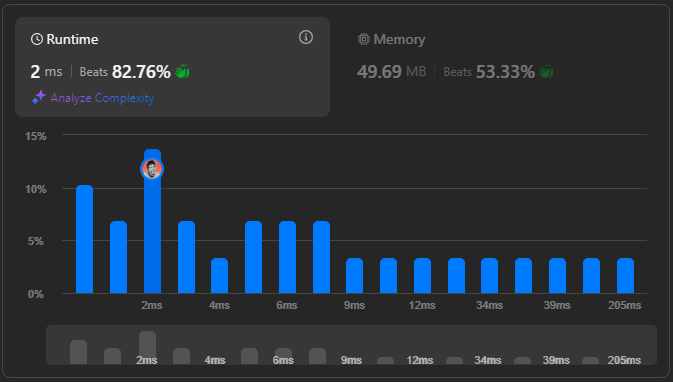
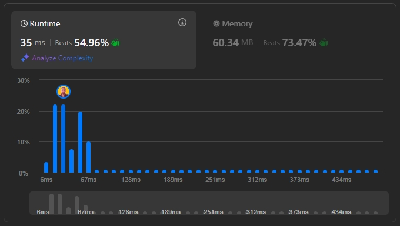
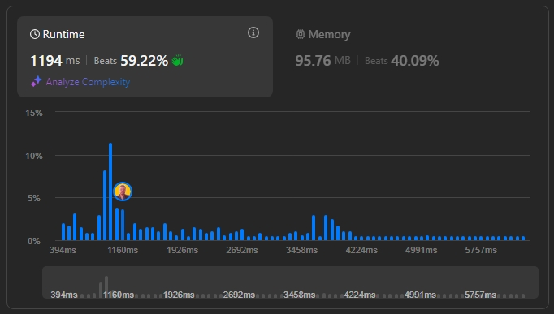

# Desafios LeetCode: Greed
 
**Conteúdo da Disciplina**: Algorítmos Ambiciosos

## 👥 Alunos
| Matrícula   | Aluno           |
|-------------|------------------|
| 18/0098080  | Arthur Trindade  |
| 20/2023968  | Miguel Moreira   |

## 📝 Sobre
Este repositório contém a solução de desafios envolvendo Algorítmos Ambiciosos no juiz online LeetCode. Foram resolvidas as questões difíceis de números **1402** e **630**, e as questões de dificuldade média de número **1584** e **aaa**.

**Tecnologias Utilizadas**: C++ e Javascript

### Desafios Solucionados
| Código | Desafio                                                                                                      | Dificuldade |
|--------|--------------------------------------------------------------------------------------------------------------|-------------|
| 1402    | [Reducing Dishes](https://leetcode.com/problems/reducing-dishes/description/) | Difícil     |
| 630    | [Course Schedule III](https://leetcode.com/problems/course-schedule-iii/description/) | Difícil     |
| 1584    | [Min Cost to Connect All Points](https://leetcode.com/problems/min-cost-to-connect-all-points/description/) | Média     |
| aaa    | [name](link) | Média     |

## 📸 Screenshots

  

  Resultado da submissão da solução para o desafio 1402.

  

  Resultado da submissão da solução para o desafio 630.

  

  Resultado da submissão da solução para o desafio 1584.

  

  Resultado da submissão da solução para o desafio aaa.

## 🚀 Uso
Para testar cada desafio:
1. Clique no link do desafio na tabela de questões da seção **Sobre**.
2. Cole o código referente ao desafio no campo de texto disponível na página do LeetCode.
3. Clique em **Run** para rodar a solução.

## 📚 Outros
  Este projeto visa exercitar conceitos de Algorítmos Ambiciosos vistos em sala de aula, abordando diferentes níveis de dificuldade em problemas propostos no LeetCode.

## 🎥 Entrega de Vídeo

Para complementar a explicação das soluções e facilitar o entendimento dos conceitos aplicados em cada desafio, incluímos uma apresentação em vídeo.

### 📹 Link para o Vídeo
[Entrega de Greed (1402 e aaaa)](link)  
[Entrega de Greed (630 e 1584)](link)
